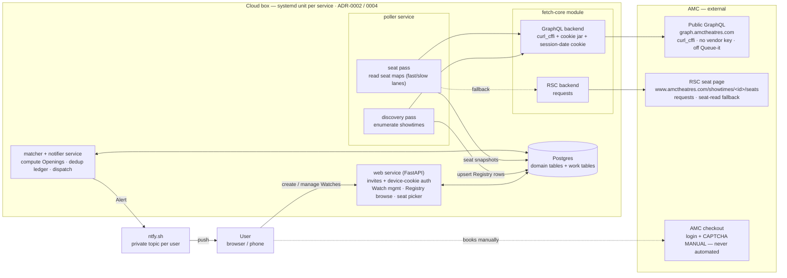
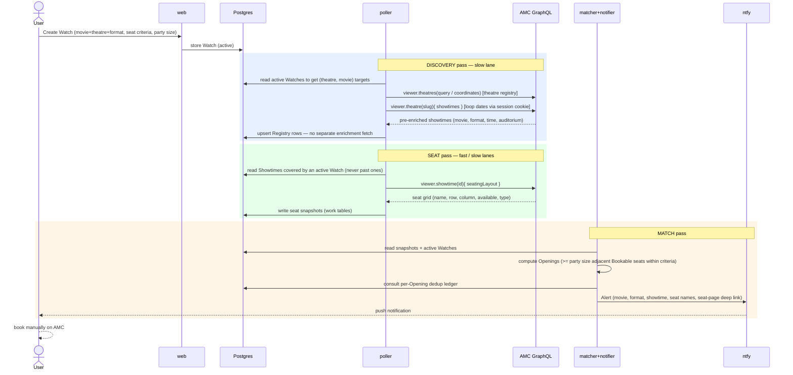
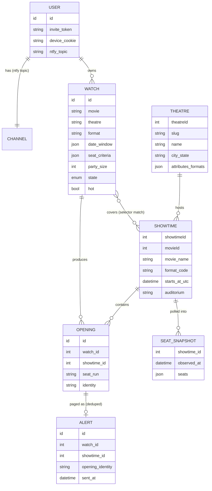
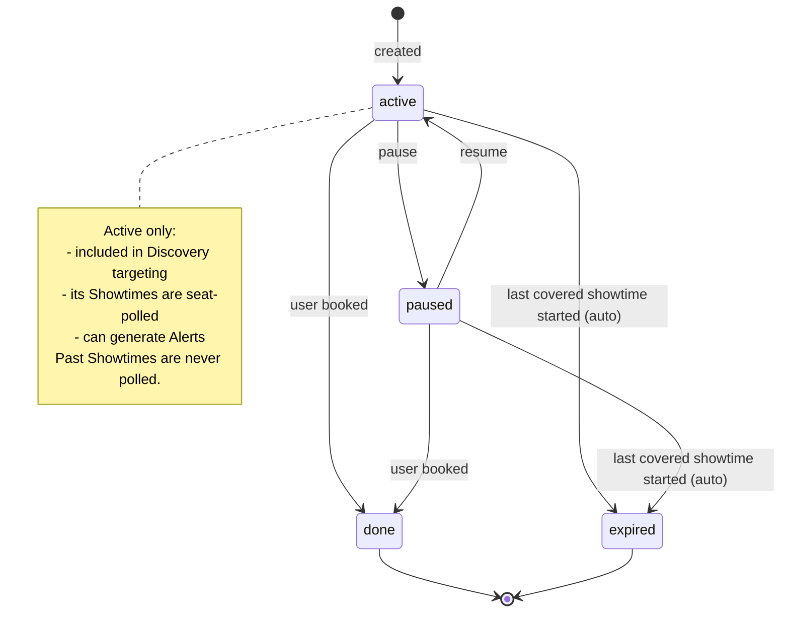
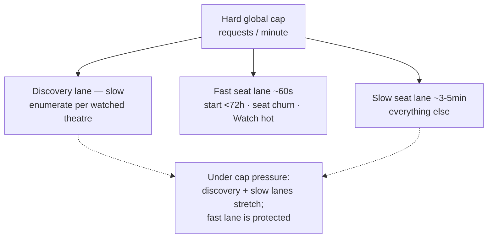
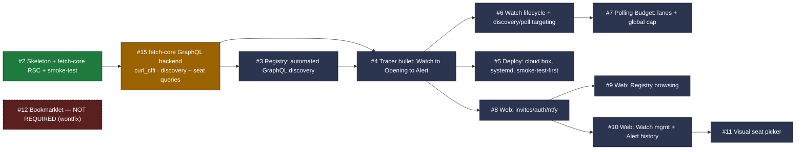

# System design — amc-ticket-tracker (GraphQL-discovery architecture)

The invite-only hosted seat-watcher, as redesigned around **automated discovery via AMC's
public GraphQL API** (ADR-0005; supersedes ADR-0001). No human contribution, no bookmarklet.
Diagrams are Mermaid — GitHub renders them inline; in VSCode use the *Markdown Preview
Mermaid Support* extension (or any Mermaid preview) and open this file's preview.

> **One-line summary:** a poller enumerates showtimes for the theatres/movies people are
> watching (GraphQL), reads seat maps for the covered showtimes, a matcher finds blocks of
> adjacent bookable seats inside each Watch's criteria, and an alerter pings the user's phone
> — who then books manually on AMC.

---

## 1. Component architecture

Three services on one cloud box over one Postgres, no broker (ADR-0002). The only outbound
edge is `fetch-core`, which has two backends: **GraphQL via `curl_cffi`** (primary; discovery
+ seats) and the already-built **RSC seat page via `requests`** (seat-read fallback only).

---

## 2. Runtime flow (the three passes)

Discovery, seat-polling, and matching are independent synchronous passes coordinating only
through Postgres work tables. Each is a `run_once()` the tests drive directly.

**Why discovery has no enrichment step:** the `viewer.theatre(slug){…showtimes…}` payload
already carries movie, format code+name, start time and auditorium, so a discovered row lands
fully enriched. The seat map is fetched separately (per-showtime) only when polling.

---

## 3. Domain model

The Registry is the shared pool of Showtimes (and the Theatres that host them); Watches are
selectors over it; Openings are what fire Alerts.

Key rules baked into the model:
- **Coverage is automatic** — a Watch covers every Registry Showtime matching its selector,
  including ones discovered *after* the Watch was created; no re-editing.
- **Adjacency is computed on grid coordinates only** (see CONTEXT.md "Grid Position"), never
  on printed seat numbers.
- **Bookable = AMC `CanReserve` only** — wheelchair/companion seats are "available" but never
  count toward an Opening.
- **Alerts dedup per Opening identity** — a persisting Opening never re-pages; one that closes
  and reopens pages again.

---

## 4. Watch lifecycle

Only **active** Watches drive discovery targeting, get their showtimes polled, and generate
Alerts.

---

## 5. Polling Budget

AMC's tolerance — not compute — is the scarce resource. One hard global requests/minute cap
now covers **discovery enumeration and seat reads together**.

Transport politeness is backend-specific: the GraphQL backend uses a `curl_cffi` browser TLS
fingerprint + a warmed cookie jar + jitter + a small worker pool; the RSC fallback keeps the
fresh-session / browser-UA behavior. Never a headless browser (AMC flags automation).

---

## 6. What's built vs. planned, and the build order

`fetch-core` (RSC backend), the monorepo skeleton, Alembic baseline and smoke-test are
**built** (issue #2). Everything else is planned; **#15 is the only unblocked next step.**
Arrows are the GitHub-native `blocked_by` dependencies.

**Order:** `#15 → #3 → #4`, then the operational track (`#6 → #7`, `#5`) and the web track
(`#8 → #9 / #10 → #11`). Day-one of #15: spike whether `curl_cffi` reaches
`graph.amctheatres.com` from the server/datacenter IP before building the full client.

---

## 7. Non-negotiable invariants

- **No human contribution, no bookmarklet, no fallback for them** — discovery is entirely
  automated (ADR-0005).
- **Booking stays manual** — the tool watches; the human does checkout (login + CAPTCHA +
  AMC Stubs). No Selenium/Playwright at checkout, ever.
- **The Seat Page describes itself / discovery rows arrive enriched** — showtime metadata is
  never user-supplied; format codes (e.g. InfinityVision) are stored exactly as reported,
  never hardcoded.
- **`SeatPageShapeChanged` is loud** — a parser regression fails, never silently reads "no
  seats". "AMC blocked us" and "no seats open" must never look alike.

References: `CONTEXT.md` (glossary), `docs/adr/0001`–`0005`, `docs/research/amc-discovery-mechanisms.md` (verified queries).
</content>
